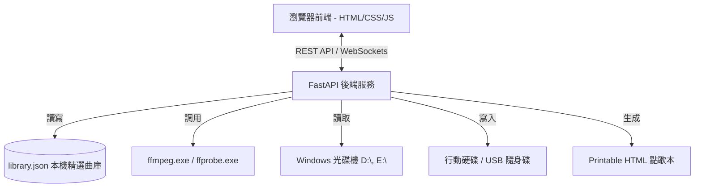

# 💿 K-Box - 系統設計與規格說明書 (System Design Document)

本文件定義了 **K-Box** 本機伴唱帶轉檔與點歌管理系統的架構、資料結構、核心流程及關鍵規格。專門針對 **Windows** 本機環境與長輩極簡操作進行優化。

---

## 1. 系統架構 (System Architecture)

K-Box 採用 **Local Web App** 架構，後端服務運行於本機 Windows 系統中，前端由瀏覽器開 localhost 進行操作。



### 1.1 Windows 環境與安全隔離設計
* **作業系統**: 主要支援 **Windows**。
* **免設定 FFmpeg**: 後端會優先偵測專案目錄 `backend/bin/` 下的 `ffmpeg.exe` 與 `ffprobe.exe`，免去修改環境變數的麻煩。
* **行動硬碟安全隔離 (Library Safety Sandbox)**:
  * 曲庫會限定儲存於行動硬碟下名為 **`K-Box_Library`** 的專屬資料夾（例如 `E:\K-Box_Library`）。
  * 系統**只會**對此專屬資料夾進行寫入、修改與讀取，行動硬碟中的其他重要檔案與個人文件**絕對不會被接觸或影響**。
* **後端**: Python FastAPI + Uvicorn (以 Windows 服務或 `.bat` 批次檔背景執行)。
* **前端**: Vanilla HTML5 + CSS Variables + ES6 JavaScript (相容 Microsoft Edge、Google Chrome)。

---

## 2. 資料庫設計 (Database Schema)

曲庫資料儲存於行動硬碟專屬資料夾 `K-Box_Library/library.json`（強制採用 UTF-8 編碼）。

### `library.json` 結構：
```json
{
  "albums": {
    "CD_20260616_1550": {
      "id": "CD_20260616_1550",
      "name": "2026-06-16 15:50 匯入的光碟",
      "ingested_at": "2026-06-16T15:50:00",
      "status": "incomplete" 
    }
  },
  "songs": {
    "song_id_001": {
      "id": "song_id_001",
      "album_id": "CD_20260616_1550",
      "album_name": "2026-06-16 15:50 匯入的光碟",
      "track_number": 3,
      "title": "川の流れのように",
      "artist": "美空ひばり",
      "duration": 210.5,
      "file_path": "songs/CD_20260616_1550/T03_川の流れのように.mp4",
      "file_size": 45120300,
      "status": "completed",
      "created_at": "2026-06-16T15:51:30"
    }
  }
}
```

* **無須命名光碟**：建庫時系統自動以時間戳命名 CD 專輯識別碼（例如 `CD_YYYYMMDD_HHMM`），省去長輩打字命名光碟的步驟。
* **特別說明**：
  * `albums.status`: 若有勾選歌曲尚未命名完成（如歌名為預設的 `Track XX`），專輯狀態會標記為 `"incomplete"`，並在 UI 首頁醒目提醒以利子女事後補齊。
  * **統一命名格式**：輸入歌曲資料需遵循 `歌名 - 歌手` 的格式（如 `川の流れのように - 美空ひばり`），以維持點歌本排版一致性。

---

## 3. 核心運作流程

K-Box 採用**選擇性轉檔（Selective Ingestion）**的漸進式建庫流程，配合**隨身碟雙向同步與收編機制**，確保點歌單與隨身碟實體檔案完全對齊：

```
第一階段：精選與建庫（CD片為單位，快速換片，免命名光碟）
放入 CD ➔ 自動偵測 Windows 光碟槽 ➔ 勾選喜愛的歌曲 ➔ 輸入歌曲資訊 (可留空) ➔ 僅轉檔勾選歌曲 ➔ 取出 CD ➔ 換片

第二階段：USB 同步、重整與列印 (含 DVD 播放器排序處理)
插上 USB ➔ 掃描 USB 檔案 ➔ (若有外部歌曲) 選擇：收編入庫/保留/刪除
  ➔ 選擇「差額同步」或「深度重整 (僅清空專屬資料夾並依序重新寫入)」
  ➔ 按編號順序複製 (Sequential Copy) 並修改檔案時間戳 (UTime Touch) ➔ 列印 A4 點歌本
```

### 3.1 第一階段：精選建庫流程 (Selective Ingestion)
1. **Windows 光碟自動偵測**：父母放入光碟後點擊網頁，系統自動偵測 Windows 光碟機（如 `D:\` 或 `E:\`）。
2. **勾選歌曲與命名**：
   * 系統掃描光碟，列出所有可用軌道（如第 1~15 首）。
   * 父母對照實體光碟殼，**僅勾選**想要收錄的歌曲。
   * 對於被勾選的歌曲，父母可以輸入 `歌名 - 歌手`。
   * **長輩免打字設計**：父母可以**直接留空**。系統會以 `Track XX` 作為預設歌名，並將該批次標記為 `"incomplete"` 供日後補檔。
3. **一鍵建庫**：父母點擊「開始轉檔已選歌曲」，後端隨即啟動背景轉檔任務，**僅針對被勾選的影片/音軌進行轉碼**。
4. **換片提示**：完成轉檔後，網頁播放提示音並顯示「轉檔完成！請取出光碟，放入下一張光碟」，流程重置。

### 3.2 第二階段：USB 同步與列印流程 (USB Sync & Re-indexing)
1. **USB 檔案對齊掃描**：插上 USB 後，系統掃描其根目錄下的所有媒體檔案，並與本機精選曲庫資料庫進行對比。
2. **外部歌曲處理（收編機制）**：
   * 若發現 USB 內存有非本系統轉檔的外部檔案，網頁會列出並提供選項。這些選項僅會對該隨身碟上的專屬歌庫資料夾進行寫入與拷貝，不影響隨身碟內的其他無關檔案。
3. **隨身碟安全同步與寫入 (USB Safety Sandbox)**：
   * 隨身碟的所有歌曲將會存放在隨身碟根目錄下的 **`K-Box_Songs`** 專屬資料夾中（例如 `G:\K-Box_Songs`）。
   * **依序複製 (Sequential Copy)**：檔案一律依 KTV 編號順序單執行緒依序複製，絕不並行寫入。
   * **時間戳重置 (UTime Touch)**：複製後，後端調用 Python `os.utime()` 重置檔案修改時間，使時間戳依 KTV 編號順序呈等差遞增。
   * **深度重整功能 (Clean Rewrite)**：網頁提供「深度重整隨身碟」按鈕。當新增歌曲或順序調整時，**僅清空隨身碟內的 `K-Box_Songs` 資料夾**，並從頭依序重新複製，保證實體排序 100% 正確。**絕對不會觸及隨身碟上的其他資料夾**。
4. **差額同步 (Delta Copy)**：日常微調時，系統亦支援僅寫入新增歌曲並自動刪除移除歌曲。
5. **列印歌本**：同步完成後，自動開啟排版精美之 A4 雙欄網頁，包含本機轉檔歌曲與收編的舊歌，一鍵列印成專屬點歌本。

### 3.3 後端技術細節 (Technical Details for DVD/VCD on Windows)
* **VCD (.DAT) 處理**：VCD 歌曲均為獨立檔案，通常位於 `MPEGAV` 目錄。後端掃描後僅將被勾選的檔案加入轉檔隊列。
* **DVD (.VOB) 自動分割技術**：
  * **情境 A (一曲一標題)**：若每一首歌為獨立的 `.VOB`（如 `VTS_01_1.VOB`、`VTS_02_1.VOB`...），則僅對被勾選的檔案進行轉碼。
  * **情境 B (長影片軌+章節)**：若整張 DVD 為一連續影片，後端利用 `ffprobe -show_chapters` 解析各章節的 `start_time` 與 `end_time`，並根據被勾選的軌道編號（對應章節 Index），調用 FFmpeg 切片轉碼。
* **轉碼目標規格**：統一轉成 **720x480 MPEG-4 (Xvid) / MP3 音訊的 AVI 格式 (.avi)**。此規格對 Dennys 等傳統卡拉OK機的 USB 播放具有最高相容性，可解決老舊解碼晶片不支援 H.264/MP4 格式導致「有聲音無畫面」或「格式不支持」的問題。
